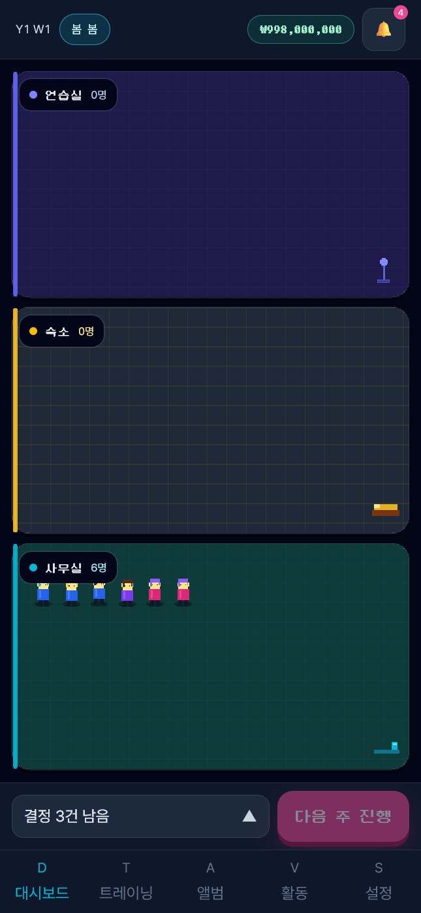
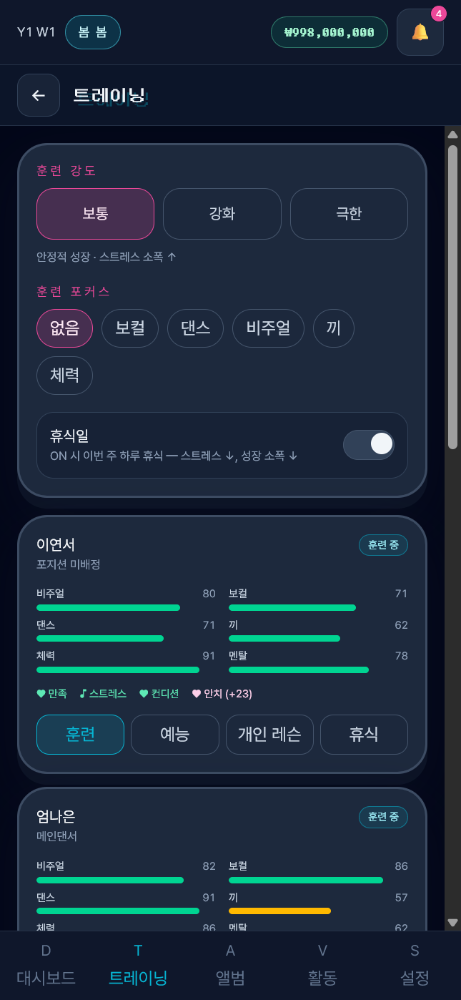
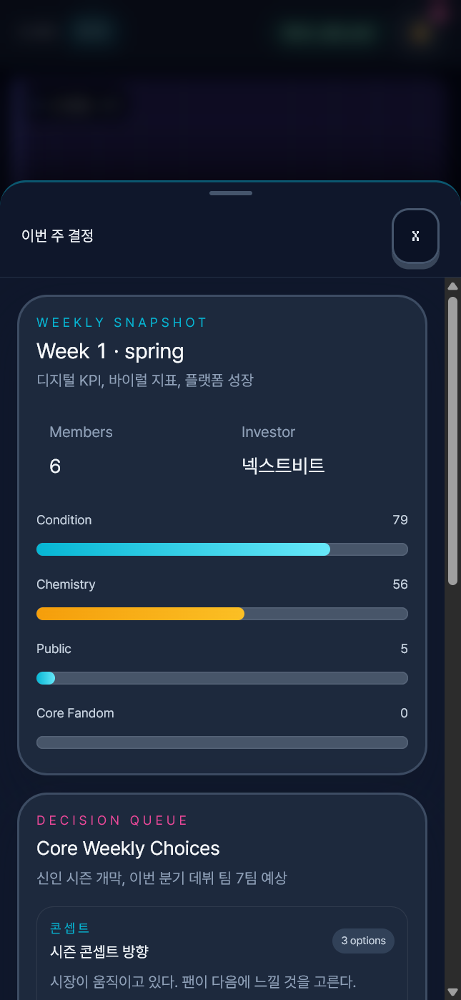
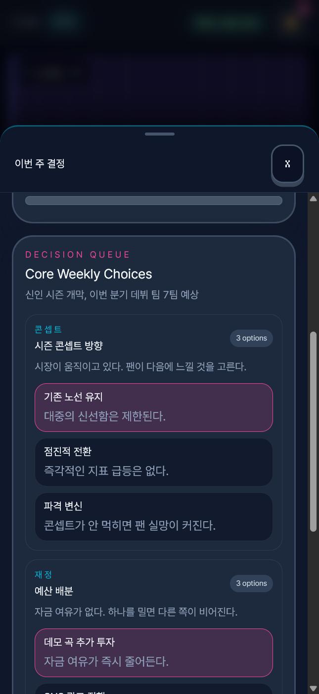
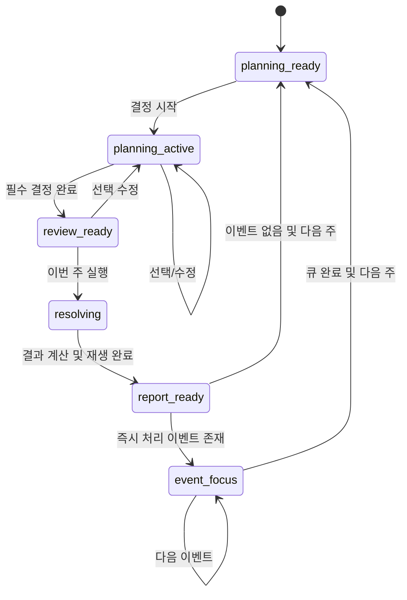
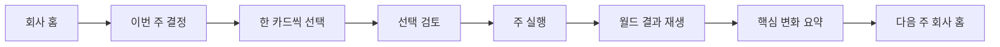
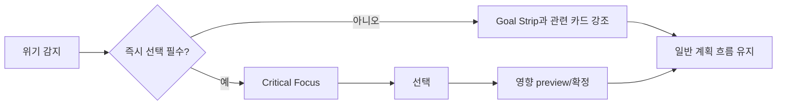
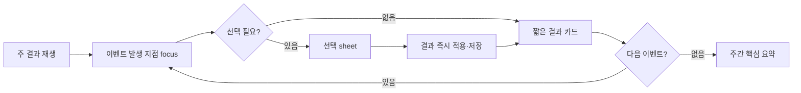

# Idolverse 메인 게임 Phase 0 UX 계약

작성일: 2026-07-14  
상태: `구현 중 — 코드 기준선·iPhone Pro 현행 캡처·IA·상태 흐름·검증 규칙 확정, 다중 폭 캡처와 사용자 5초 테스트 보류`  
상위 계획: [MAIN-GAME-UX-ARCHITECTURE-PLAN-2026-07-14.md](./MAIN-GAME-UX-ARCHITECTURE-PLAN-2026-07-14.md)

---

## 1. 문서의 역할

이 문서는 Phase 1 이후 구현자가 임의로 화면 구조나 주간 진행 규칙을 재해석하지 않도록 만드는 제품·UX 계약이다. 다음 항목을 고정한다.

- 메인 게임의 전역 정보 구조(IA)
- 모바일 한 화면의 고정 영역과 우선순위
- 정상 주·위기 주·이벤트 주의 상태 전이
- 주간 결정 완료까지의 탭·스크롤 예산
- React와 Phaser의 표시·입력 책임 경계
- 360/390/430px 및 데스크톱의 반응형 규칙
- 5초 인지 테스트와 Phase 0 승인 게이트

이 단계에서는 완성 UI를 구현하지 않는다. Phase 0의 산출물은 이후 구현을 판단할 수 있는 합의된 계약과 측정 가능한 기준선이다.

---

## 2. Phase 0 범위와 현재 상태

| 산출물 | 상태 | 근거/비고 |
|---|---:|---|
| 현재 메인 게임 코드 기준선 감사 | 완료 | `GameDashboard`, `DecisionCardDeck`, `BottomSheet`, `WeekReport`, `EventModal`, `SimulationScene` 확인 |
| 현재 탭·스크롤 비용 기록 | 완료 | 코드상 정상 주 및 이벤트 주의 최소 입력 경로 산정 |
| 새 전역 IA | 승인 후보 확정 | 회사 / 이번 주 / 멤버 / 시장 / 더보기 |
| 모바일 단일 화면 wireframe | 승인 후보 확정 | Top Status / Goal Strip / World View / Action Dock / Bottom Nav |
| 정상·위기·이벤트 상태 흐름 | 승인 후보 확정 | 본 문서 8장 |
| iPhone Pro 현행 화면 캡처 | 부분 완료 | 회사 홈, 트레이닝, 결정 sheet 개요, 결정 선택 상태 4장 확보 |
| 360/390/430px 및 desktop 비교 캡처 | 보류 | 동일 화면의 폭별 비교와 desktop 캡처가 추가로 필요 |
| 5초 인지 테스트 실측 | 보류 | 실제 신규 사용자 5명 이상 필요 |

### 2.1 확보한 현행 캡처

사용자가 직접 iPhone Pro viewport로 촬영한 645×1398px PNG 네 장을 원본 해상도로 보존했다. 브라우저의 CSS viewport와 PNG 출력 배율은 별도로 기록되지 않았으므로 360/390/430px 중 하나로 임의 환산하지 않고 `iPhone Pro` 기준선으로 표기한다.

| 화면 | 파일 |
|---|---|
| 회사 홈 | [`current-main-iphone-pro.png`](./assets/phase-0/current-main-iphone-pro.png) |
| 트레이닝 | [`current-training-iphone-pro.png`](./assets/phase-0/current-training-iphone-pro.png) |
| 결정 sheet 첫 진입 | [`current-decisions-overview-iphone-pro.png`](./assets/phase-0/current-decisions-overview-iphone-pro.png) |
| 결정 선택·스크롤 상태 | [`current-decisions-selected-iphone-pro.png`](./assets/phase-0/current-decisions-selected-iphone-pro.png) |

#### 회사 홈



#### 트레이닝



#### 결정 sheet 첫 진입



#### 결정 선택·스크롤 상태



### 2.2 추가 캡처 슬롯

필수 캡처 파일명:

- `docs/assets/phase-0/current-main-360x800.png`
- `docs/assets/phase-0/current-main-390x844.png`
- `docs/assets/phase-0/current-main-430x932.png`
- `docs/assets/phase-0/current-main-desktop-1440x900.png`
- `docs/assets/phase-0/current-decisions-390x844.png`
- `docs/assets/phase-0/current-week-report-390x844.png`
- `docs/assets/phase-0/current-event-390x844.png`

권장 캡처 높이는 대표 기기 기준이며, 폭 360/390/430px 검증이 핵심이다.

---

## 3. 현재 구현 기준선

### 3.1 현재 화면 구조

현재 `GameDashboard`는 다음 순서다.

```text
GameDashboard
├─ Header: 연도/주차, 계절, 자금, 알림
├─ Active tab content
│  ├─ Dashboard
│  │  ├─ PhaserGame
│  │  ├─ SimulationOverlay
│  │  └─ 결정 열기 + 다음 주 진행
│  ├─ Training
│  └─ Album / Activity / Settings placeholder
├─ 5-tab navigation
├─ Decision BottomSheet
│  ├─ WeeklySummary
│  └─ DecisionCardDeck
├─ WeekReport modal
└─ EventModal queue
```

### 3.2 현재 장점

- React가 상태 표시와 주간 진행 버튼을 담당하고 Phaser가 월드 뷰를 담당하는 방향 자체는 유지할 가치가 있다.
- 모든 주요 버튼은 대체로 44px 최소 터치 영역을 만족한다.
- 주간 결정은 게임 규칙에 맞게 `weeklyDecisions`로 집중되어 있다.
- 다음 주 진행 전에 모든 결정을 요구하여 불완전 실행을 막는다.
- 주간 리포트와 이벤트가 순차적으로 표시되어 데이터 적용 순서는 비교적 명시적이다.

### 3.3 현재 핵심 문제

#### A. 홈 화면에서 다음 행동의 이유가 보이지 않는다

헤더에는 주차·계절·자금·알림이 있지만 다음 정보가 없다.

- 이번 주 목표
- 가장 가까운 마감
- 현재 가장 위험한 상태
- 투자자 KPI 진행도
- 결정했을 때 무엇을 얻거나 포기하는지

결정 카드는 bottom sheet를 열기 전에는 제목과 내용조차 확인할 수 없다. 따라서 사용자는 `결정 N건 남음`이라는 수량은 알지만 무엇을 판단해야 하는지는 모른다.

#### B. 중요한 판단과 실행이 서로 다른 레이어에 분리되어 있다

결정 선택은 bottom sheet 내부, 주간 실행은 sheet 밖의 action row에 있다. 모든 선택을 마친 뒤 sheet를 닫고 `다음 주 진행`을 다시 눌러야 한다. 이 구조는 완료 상태의 연속성을 끊는다.

#### C. 결정 덱이 ‘한 번에 한 판단’이 아니라 긴 폼처럼 동작한다

모든 카드와 모든 옵션을 한 세로 목록에 펼친다. 3~4개 결정이라도 스크롤 거리가 길고, 현재 결정·남은 결정·상호 기회비용을 비교하기 어렵다.

#### D. 월드가 게임 상태를 설명하지 못한다

Phaser는 연습실·숙소·사무실의 세 개 큰 패널, 간단한 도형 캐릭터, 반복적인 idle tween을 표시한다. React overlay는 방 이름과 인원 수만 덧씌운다.

- 시설의 구체적 상태와 업그레이드 차이가 약함
- 멤버가 무엇을 하고 왜 하는지 보이지 않음
- 월드 오브젝트를 눌러 상세 맥락으로 이동할 수 없음
- 주간 결정 결과가 공간 변화나 캐릭터 행동으로 재생되지 않음
- Canvas와 React가 같은 방 경계를 별도로 계산·표시함

즉 현재 월드는 조작 가능한 경영 공간보다 배경 애니메이션에 가깝다.

#### E. 전역 내비게이션이 실제 게임 모델과 일치하지 않는다

현재 탭은 `대시보드 / 트레이닝 / 앨범 / 활동 / 설정`이며 세 개가 placeholder다. 이 구분은 기능 이름 중심이고, 플레이어가 반복하는 경영 질문 중심이 아니다.

- 지금 무엇을 해야 하는가?
- 멤버 상태는 어떤가?
- 시장과 경쟁 상황은 어떤가?
- 회사의 장기 성장은 어떤가?

새 IA는 이 네 질문을 직접 반영해야 한다.

#### F. 결과 리포트의 정보 밀도가 우선순위를 갖지 않는다

`WeekReport`는 능력치, 부상, 케미, 재정, 이벤트, 뉴스, 경쟁 그룹, 경고를 동일한 카드 수준으로 나열한다. 중요한 변화와 변화 없음이 같은 공간 비용을 소비하고, 결정의 예상 결과와 실제 결과 연결도 없다.

#### G. 언어와 시각 문법이 섞여 있다

`Weekly Snapshot`, `Decision Queue`, `Core Weekly Choices`, `options` 등 영문 UI가 한글 게임 흐름에 섞인다. 픽셀 텍스트와 시스템 텍스트의 역할 구분도 일관되지 않다.

### 3.4 iPhone Pro 캡처 기반 시각 감사

#### H. 월드가 화면의 약 79%를 차지하지만 전달하는 정보는 방별 인원 수뿐이다

회사 홈에서 헤더와 하단 조작부를 제외한 대부분이 세 개의 동일한 가로 방에 할당된다. 각 방은 큰 격자 바닥과 작은 시설 motif만 있고 연습실·숙소는 0명, 사무실은 6명이 한 줄로 정지해 있다.

결과적으로 가장 큰 시각 영역에서 읽을 수 있는 정보는 사실상 다음 세 개뿐이다.

- 연습실 0명
- 숙소 0명
- 사무실 6명

카이로소프트형 월드가 주는 시설 밀도, 작업 상태, 캐릭터 목적, 생산 chain, 확장 욕구가 없다. 단순히 artwork가 부족한 문제만이 아니라, 월드가 어떤 game state를 시각화해야 하는지 정의되지 않은 문제다.

개선 계약:

- 같은 높이의 방 3분할을 폐기하고 회사 전체를 하나의 연속 공간으로 구성한다.
- 시설 footprint, 출입구, 동선, 작업 point, 잠금/업그레이드 상태를 실제 월드 정보로 만든다.
- `0명`인 방도 현재 비어 있는 이유와 예정 활동을 표현한다.
- 멤버 sprite 위에는 상시 이름표 대신 활동 icon, 컨디션/위기 marker, 짧은 thought bubble만 노출한다.

#### I. 헤더에서 계절이 `봄 봄`으로 중복되고 자금이 과도하게 지배적이다

계절 badge가 아이콘과 label 자리에 같은 문자열을 넣어 `봄 봄`으로 보인다. 자금은 픽셀 폰트와 녹색 pill로 강하게 강조되어 있지만, 현재 경영 판단에 더 중요한 목표·마감·결정 수는 그보다 약하다.

개선 계약:

- 계절은 단일 label과 계절 icon 또는 색상으로 표현한다.
- 자금은 compact notation을 기본으로 하고 눌렀을 때 정확한 금액을 표시한다.
- 자금보다 Goal Strip과 다음 행동의 hierarchy가 높아야 한다.
- 극단적으로 큰 금액에서도 header 폭을 침범하지 않는 formatter를 사용한다.

#### J. 하단 Action Dock은 상태만 말하고 판단 맥락을 제공하지 않는다

`결정 3건 남음`과 비활성 `다음 주 진행`만 보인다. 사용자는 왜 결정해야 하는지, 가장 중요한 결정이 무엇인지, 언제 버튼이 활성화되는지 알 수 없다. 비활성 버튼도 큰 magenta 면적과 그림자를 유지해 활성 CTA처럼 보인다.

개선 계약:

- dock 첫 줄은 `이번 주 결정 0/3`, 둘째 줄은 목표 또는 핵심 위험을 표시한다.
- CTA label은 `결정 시작하기 → 결정 계속하기 → 선택 검토하기 → 이번 주 실행하기`로 상태에 맞게 변한다.
- disabled CTA는 장식 색과 그림자를 제거하고, 비활성 이유를 dock 문구로 설명한다.

#### K. 하단 탭의 문자 아이콘과 낮은 대비가 완성도를 떨어뜨린다

`D/T/A/V/S`가 실제 icon을 대신하며 한글 label과 의미가 직접 연결되지 않는다. 비활성 label의 대비가 낮고, 세 개 탭은 실제로 placeholder라 눌러도 가치가 없다.

개선 계약:

- 문자 placeholder를 16~24px 단색 icon set으로 교체한다.
- active 상태는 cyan 색뿐 아니라 선택 배경 또는 상단 indicator를 함께 사용한다.
- 미완성 기능은 전역 nav에서 제거하거나 `더보기` 아래에 preview로 둔다.

#### L. 트레이닝 화면은 조작은 가능하지만 장기 세로 폼에 가깝다

상단 전역 훈련 강도·포커스·휴식일과 멤버별 카드가 한 scroll에 이어진다. 멤버 카드마다 6개 능력치 bar, 관계 chip, 네 개 활동 버튼이 반복되어 한 화면에서 한 명 정도만 온전히 볼 수 있다.

문제:

- 전역 설정과 멤버별 이번 주 배정의 차이가 명확하지 않다.
- 멤버 수가 늘수록 scroll 비용이 선형으로 증가한다.
- 현재 주의 가용 slot, 비용, 피로 위험, 포기하는 활동이 보이지 않는다.
- 하단 nav가 화면을 고정 점유하지만 별도 적용/완료 CTA는 없다.
- 브라우저 scrollbar가 게임 UI의 일부처럼 강하게 노출된다.

개선 계약:

- `이번 주`에서 멤버 배정을 시간/slot 기반 board로 요약한다.
- 멤버 상세 조정은 한 명을 선택한 context sheet에서 수행한다.
- roster row에는 핵심 2~3개 지표와 현재 배정만 표시한다.
- 훈련 선택 전에 기대 성장, 피로, 스트레스, 다른 활동 포기를 함께 표시한다.
- 전역 강도는 매니저 AI 정책으로 명명하여 멤버별 명령과 구분한다.

#### M. 결정 sheet의 첫 화면이 `Weekly Snapshot`에 소비된다

sheet를 열면 화면 대부분을 Snapshot 카드가 차지하고 실제 첫 결정은 fold 아래에서 시작한다. 사용자가 이미 회사 홈 헤더에서 본 주차와 멤버 수를 다시 읽는 반면, 이 sheet를 연 목적이었던 결정 선택에는 곧바로 도달하지 못한다.

개선 계약:

- sheet header에 `결정 1/3`과 현재 목표를 한 줄로 압축한다.
- Condition/Chemistry/Public/Core Fandom 전체 bar는 기본 결정 흐름에서 제거한다.
- 현재 카드에 영향을 주는 2~3개 지표만 카드 안에 context로 표시한다.
- 전체 주간 snapshot은 `자동 운영/상태 상세` secondary sheet로 이동한다.

#### N. 결정 목록은 선택 진행도·완료 CTA가 없는 긴 카드 stack이다

실제 캡처에서 첫 결정의 세 옵션과 둘째 결정의 일부를 보려면 이미 크게 scroll해야 한다. 선택 상태는 magenta border/background만으로 표시되고 check, 선택 요약, `1/3 완료` 진행도, sticky CTA가 없다.

개선 계약:

- 한 화면에 한 결정 카드만 집중 표시한다.
- 상단에 `1/3`, 카드 점 indicator, 이전 선택 요약 chip을 고정한다.
- 선택 option에는 check와 예상 효과 요약을 표시한다.
- 선택 즉시 다음 카드로 전환하되 animation은 160~220ms 범위로 제한한다.
- 마지막 선택 후 동일 surface에서 검토 화면과 실행 CTA로 이어진다.
- sheet를 닫아 외부 CTA를 찾게 하지 않는다.

### 3.5 캡처로 확정된 문제 우선순위

| 우선순위 | 문제 | 영향 | 대응 Phase |
|---:|---|---|---|
| P0 | 결정 sheet와 실행 CTA 분리 | 핵심 loop 단절 | Phase 1 상태 모델, Phase 2 shell |
| P0 | 월드의 정보 밀도·상호작용 부재 | 메인 화면 가치 부족 | Phase 3 world vertical slice |
| P0 | 목표·마감·위험 부재 | 다음 행동 판단 불가 | Phase 2 Goal Strip/Action Dock |
| P1 | Snapshot이 첫 결정을 fold 아래로 밀어냄 | 불필요한 scroll | Phase 2 decision flow |
| P1 | 트레이닝의 반복 카드 stack | 멤버 증가 시 사용성 붕괴 | Phase 4 roster/schedule redesign |
| P1 | placeholder nav와 문자 icon | 낮은 신뢰·완성도 | Phase 2 navigation |
| P2 | 한영 혼용·계절 중복 | 시각 일관성 저하 | Phase 2 copy/token cleanup |

---

## 4. 현재 입력 비용 기준선

아래 수치는 코드 경로상 최소 탭이며 스크롤, 내용을 읽는 시간, 잘못 누른 뒤 수정하는 탭은 제외한다.

### 4.1 정상 주

| 단계 | 현재 입력 |
|---|---:|
| 결정 sheet 열기 | 1 tap |
| 3개 카드 옵션 선택 | 3 taps + 다수 scroll |
| sheet 닫기 | 1 tap |
| 다음 주 진행 | 1 tap |
| 주간 리포트 닫기 | 1 tap |
| 합계 | **7 taps + scroll** |

결정이 4개면 **8 taps + scroll**이다.

### 4.2 이벤트 1개가 발생한 주

정상 주 입력 뒤에 다음이 추가된다.

| 단계 | 현재 입력 |
|---|---:|
| 이벤트 선택지 선택 | 1 tap |
| 선택 결과 확인 | 1 tap |
| 추가 합계 | **2 taps** |

따라서 3결정 + 이벤트 1개는 **9 taps + scroll**, 4결정 + 이벤트 1개는 **10 taps + scroll**이다.

### 4.3 탭 수보다 더 큰 문제

7~10회 자체가 절대적으로 과도하지는 않다. 더 큰 문제는 입력의 의미가 끊기는 것이다.

```text
결정 발견 → 별도 레이어 진입 → 긴 목록 스크롤 → 레이어 탈출
→ 실행 버튼 재탐색 → 긴 리포트 → 이벤트 재진입
```

Phase 0 목표는 무조건 탭을 줄이는 것이 아니라, 각 탭이 다음 상태로 자연스럽게 이어지고 현재 위치·남은 작업·결과를 잃지 않게 하는 것이다.

---

## 5. 제품 UX 원칙

### P1. 한 화면에서 ‘현재 상태 → 이번 주 목표 → 다음 행동’이 이어져야 한다

홈 화면을 5초 보았을 때 플레이어는 아래 세 문장을 말할 수 있어야 한다.

1. 지금은 몇 년 몇 주차이고 어떤 시즌이다.
2. 이번 주 가장 중요한 목표 또는 위험은 이것이다.
3. 다음에는 이 버튼을 누르면 된다.

### P2. 한 번에 한 가지 중요한 판단만 요구한다

주간 결정은 3~4개지만 한 화면에 여러 카드의 모든 옵션을 동시에 펼치지 않는다. 한 카드에 집중하되 전체 진행도와 이전 선택 요약은 항상 보인다.

### P3. 자동 처리와 플레이어 선택의 경계를 설명한다

매니저 AI가 자동 처리하는 항목은 숨기지 않고 ‘자동 운영’ 요약으로 보여준다. 플레이어가 통제하지 않은 결과도 원인을 이해할 수 있어야 한다.

### P4. 기회비용은 선택 전, 결과와 원인은 선택 후 보여준다

- 선택 전: 예상 이득, 비용, 놓치는 기회, 영향 대상
- 선택 후: 실제 변화, 예상과의 차이, 차이가 발생한 원인

### P5. 월드는 상태를 장식하는 배경이 아니라 탐색 가능한 회사다

시설·멤버·활동이 상태를 보여주고, 누르면 그 맥락의 React 상세 패널을 연다.

### P6. Canvas와 React는 같은 정보를 두 번 소유하지 않는다

Phaser는 공간·캐릭터·환경 애니메이션과 월드 hit target을, React는 텍스트·수치·선택·탐색·접근성을 담당한다.

### P7. 경고의 강도는 플레이 흐름 방해 수준과 비례한다

모든 이벤트를 modal로 만들지 않는다. 치명적이고 즉시 선택해야 하는 사건만 흐름을 중단한다.

---

## 6. 승인 후보 IA

### 6.1 모바일 하단 전역 내비게이션

| 탭 | 답하는 질문 | 핵심 내용 |
|---|---|---|
| **회사** | 지금 회사에서 무슨 일이 일어나는가? | 월드, 목표, 위험, 다음 행동 |
| **이번 주** | 이번 주에 무엇을 결정하고 실행하는가? | 결정 덱, 자동 운영, 검토, 실행 |
| **멤버** | 누구의 상태와 관계를 관리해야 하는가? | 로스터, 능력치, 컨디션, 케미, 포지션 |
| **시장** | 어떤 기회와 위협이 오는가? | 시즌 수요, 경쟁 그룹, 차트, 뉴스 |
| **더보기** | 자주 쓰지 않는 장기 관리 기능은? | 앨범 아카이브, 시설, 재정 상세, 설정, 저장 |

### 6.2 현재 탭의 이관

| 현재 | 새 위치 |
|---|---|
| 대시보드 | 회사 |
| 트레이닝 | 이번 주의 결정/자동 운영 또는 멤버 상세 |
| 앨범 | 더보기 또는 이번 주의 활성 프로젝트 |
| 활동 | 이번 주의 결정/일정 |
| 설정 | 더보기 |

### 6.3 내비게이션 계약

- 전역 하단 탭은 언제나 동일한 순서와 의미를 유지한다.
- 현재 주의 필수 결정이 남으면 `이번 주` 탭에 숫자 badge를 표시한다.
- 위기는 `회사`와 관련 탭에 severity dot을 표시하되, 치명적 위기가 아니면 자동으로 modal을 열지 않는다.
- 월드의 방·멤버를 누르면 전역 탭을 바꾸는 대신 context sheet를 연다.
- sheet에서 `상세 보기`를 선택할 때만 해당 전역 탭으로 이동한다.
- 뒤로가기는 상세 → sheet → 직전 전역 탭 순서로 복귀한다.

---

## 7. 단일 화면 레이아웃 계약

### 7.1 모바일 회사 홈

```text
┌──────────────────────────────────────┐
│ Y1 W12 · 여름       ₩42.5M   알림 2 │  Top Status 48px
├──────────────────────────────────────┤
│ 목표: 데뷔 쇼케이스 D-3  █████░ 72% │  Goal Strip 36px
├──────────────────────────────────────┤
│                                      │
│         INTERACTIVE COMPANY WORLD    │
│                                      │
│  [연습실] [스튜디오]                 │
│  캐릭터 활동·말풍선·위험 표식        │  flexible
│  [사무실] [숙소]                     │
│                                      │
├──────────────────────────────────────┤
│ 이번 주 결정 2/3                     │
│ 위험: 하나 컨디션 34 · 공연 D-3      │  Action Dock 80–96px
│ [결정 계속하기]                      │
├──────────────────────────────────────┤
│ 회사  이번 주  멤버  시장  더보기   │  Bottom Nav 64px + safe area
└──────────────────────────────────────┘
```

### 7.2 영역별 정보 우선순위

#### Top Status Bar

항상 보이는 정보:

- 연도·주차
- 계절
- 현재 자금
- 통합 알림 진입점

보이지 않는 정보:

- 모든 팬 지표
- 모든 투자자 KPI
- 여러 종류의 화폐

#### Goal Strip

가장 가까운 주요 마감 또는 현재 투자자 KPI 하나만 표시한다.

- 기본: 다음 주요 일정 + D-day
- 위기: 가장 치명적인 위기로 대체
- 목표 달성 직전: 진행률과 필요 조건 표시
- 눌렀을 때 목표 상세 sheet

#### World View

- 공간 배치, 멤버 현재 활동, 시설 상태
- 상태 변화의 짧은 diegetic feedback
- 최대 1개의 선택된 대상과 최대 3개의 상태 표식
- 장문의 텍스트, 표, 다중 CTA 금지

#### Action Dock

다음 필수 행동을 한 문장과 하나의 primary CTA로 제시한다.

- 결정 전: `이번 주 결정 시작하기`
- 진행 중: `결정 계속하기 · 2건 남음`
- 검토 가능: `선택 검토하기`
- 실행 가능: `이번 주 실행하기`
- 결과 대기: `결과 재생 중`
- 리포트: `주간 결과 보기`

secondary action은 최대 1개다. 예: `자동 운영 보기`.

#### Bottom Navigation

- 5개 고정 탭
- 아이콘 + 한글 label 동시 표시
- 각 hit area 최소 44×44px
- active 상태는 색뿐 아니라 배경/형태도 변화

### 7.3 모바일 수직 예산

| 영역 | 360×800 | 390×844 | 430×932 |
|---|---:|---:|---:|
| Top Status | 48 | 48 | 52 |
| Goal Strip | 36 | 36 | 40 |
| World View | flex, 약 548 | flex, 약 592 | flex, 약 664 |
| Action Dock | 88 | 88 | 96 |
| Bottom Nav | 64 + safe | 64 + safe | 64 + safe |

정확한 viewport 높이는 safe area와 브라우저 chrome에 따라 달라지므로 world만 유연하게 늘고 줄어야 한다.

### 7.4 데스크톱

```text
┌──────────────────────────────────────────────────────────────┐
│ Top Status / Goal Strip                                      │
├─────────────────────────────────┬────────────────────────────┤
│                                 │ 이번 주 Command Panel      │
│         Company World           │ - 목표/위험                │
│                                 │ - 결정 진행도              │
│                                 │ - 자동 운영 요약           │
│                                 │ - primary CTA              │
├─────────────────────────────────┴────────────────────────────┤
│ 회사        이번 주        멤버        시장        더보기   │
└──────────────────────────────────────────────────────────────┘
```

- 1024px 이상에서 world와 command panel을 2열로 배치한다.
- command panel 권장 폭은 360~400px이다.
- 모바일 sheet 콘텐츠와 데스크톱 command panel은 같은 React 컴포넌트를 사용한다.
- 단순히 모바일 전체를 `max-w-md`로 가운데 두고 양옆을 비우지 않는다.
- 게임 월드의 최대 가시 폭은 720~840px, 전체 shell 최대 폭은 1200px를 기준으로 조정한다.

---

## 8. 주간 상태 머신 계약

### 8.1 공통 상태



### 8.2 상태별 UI 계약

| 상태 | World | Action Dock | 이번 주 탭 | 차단 overlay |
|---|---|---|---|---|
| `planning_ready` | 현재 활동 | 결정 수·핵심 위험 | 첫 카드 preview | 없음 |
| `planning_active` | 유지 | 남은 결정 수 | 집중 카드 | 없음 |
| `review_ready` | 선택 영향 preview | 실행 CTA | 선택 요약 | 없음 |
| `resolving` | 결과 playback | 비활성 progress | 읽기 전용 | 입력 차단 |
| `report_ready` | 결과 상태 | 결과 보기 | delta 요약 | 중요 결과 sheet |
| `event_focus` | 관련 공간 focus | 이벤트 진행 | 잠금/읽기 전용 | 선택이 필수일 때만 modal/sheet |

### 8.3 정상 주



규칙:

- 결정 카드는 한 번에 하나를 기본으로 한다.
- 선택하면 다음 카드로 자동 이동하되, 이전 선택 chip을 눌러 수정할 수 있다.
- 마지막 선택 후 바로 주를 실행하지 않는다. 검토 단계를 반드시 둔다.
- 결과 리포트는 변화가 있는 항목을 우선한다.
- `변동 없음` 섹션은 접거나 생략한다.

### 8.4 위기 주

위기는 세 단계로 분류한다.

| 등급 | 예 | UI |
|---|---|---|
| Notice | 경미한 컨디션 저하 | world 표식 + goal/action 문구 |
| Warning | 다음 일정 실패 가능 | goal strip 경고 + 관련 결정 우선 정렬 |
| Critical | 즉시 선택 없이는 진행 불가 | focus overlay 또는 modal로 진행 차단 |



규칙:

- 위기라는 이유만으로 모든 화면을 붉게 만들지 않는다.
- 경고는 대상·마감·예상 손실을 함께 말한다.
- critical 선택 후 결과를 저장하고 원래 계획 위치로 복귀한다.

### 8.5 이벤트 주



규칙:

- 리포트 전체를 먼저 닫고 이벤트 modal을 다시 여는 현재 순서를 없앤다.
- 결과 playback 중 사건이 발생한 시간·공간을 먼저 보여준다.
- 이벤트 queue의 현재 번호를 표시한다. 예: `이벤트 1/2`.
- 선택 직후 결과 적용과 autosave를 완료한다.
- 이벤트 종료 후 주간 핵심 변화 요약으로 합류한다.

### 8.6 상태 영속화 요구

Phase 1에서 다음 값이 저장 가능해야 한다.

```ts
type WeeklyFlowState =
  | "planning_ready"
  | "planning_active"
  | "review_ready"
  | "resolving"
  | "report_ready"
  | "event_focus";

interface WeeklyFlowSnapshot {
  state: WeeklyFlowState;
  selectedDecisionIds: Record<string, string>;
  eventQueueIds: string[];
  activeEventIndex: number;
  resolutionId: string | null;
}
```

이는 설계 계약을 설명하기 위한 예시이며 Phase 0에서 타입을 제품 코드에 추가하지 않는다.

---

## 9. 목표 입력 예산

### 9.1 정상 주

| 단계 | 목표 입력 |
|---|---:|
| 회사 홈에서 결정 시작 | 1 tap |
| 3개 결정 선택 | 3 taps, 필요 시 0~2 swipes |
| 선택 검토 | 자동 진입 또는 1 tap |
| 주 실행 | 1 tap |
| 핵심 결과 닫기/다음 주 | 1 tap |
| 합계 | **6~7 taps, 최대 2 swipes** |

4결정 주는 **7~8 taps**를 허용한다. 탭 수는 현재와 비슷할 수 있지만 sheet 닫기와 CTA 재탐색이 사라지고 흐름이 단일 선형 경로가 된다.

### 9.2 수정 비용

- 검토 화면에서 기존 선택 수정: 최대 2 taps
- 수정 후 검토 복귀: 자동
- 전체 초기화: 더보기 메뉴 내부, 오입력 방지를 위해 확인 필요

### 9.3 이벤트 비용

- 선택 없는 이벤트: 별도 tap 0~1
- 선택 이벤트: 선택 1 + 확인/계속 1
- 이벤트 1개당 추가 입력 최대 2 taps

### 9.4 제스처 계약

- 핵심 진행을 좌우 swipe에만 의존하지 않는다.
- swipe는 다음/이전 카드 이동의 보조 입력이다.
- 항상 눈에 보이는 버튼으로 같은 동작을 수행할 수 있어야 한다.
- 세로 scroll 안에 가로 swipe 영역을 중첩하지 않는다.
- primary CTA는 화면 하단의 안정된 위치를 유지한다.

---

## 10. React–Phaser 렌더링 계약

### 10.1 Phaser가 소유하는 것

- 방·시설·가구·캐릭터 sprite
- 캐릭터 이동과 활동 animation
- 환경 효과, 시간대, 결과 playback
- 월드 좌표 기반 hit target
- 카메라 pan/zoom이 필요한 경우 그 동작

### 10.2 React가 소유하는 것

- Top Status, Goal Strip, Action Dock, Bottom Navigation
- 텍스트, 수치, 진행률, 목록, 카드, tooltip
- 결정 선택, 검토, 결과 요약, 이벤트 선택
- modal, sheet, focus management, keyboard 접근성
- world selection에서 열린 상세 패널

### 10.3 금지되는 중복

- Phaser 방 사각형과 React overlay가 각각 방 layout을 계산하는 구조
- Phaser가 텍스트 label을 그리고 React가 같은 label을 다시 표시하는 구조
- React DOM 위치가 Canvas 내부 좌표를 추측하여 따라가는 구조
- 두 렌더러가 같은 선택 상태를 로컬 state로 각각 보유하는 구조

### 10.4 허용되는 통신

```text
Zustand domain state
        │
        ├─ React selectors → UI 표시/선택
        └─ Phaser subscriptions → world diff

Phaser world click → EventBus semantic event → React context sheet
React command → store/system action → Phaser observes resulting state
```

EventBus payload는 좌표나 DOM 세부사항이 아니라 의미를 전달한다.

```ts
type WorldSelection =
  | { kind: "trainee"; id: string }
  | { kind: "facility"; id: string }
  | { kind: "room"; id: string };
```

### 10.5 렌더링 품질 기준

- Phaser canvas는 `image-rendering: pixelated`와 정수 배율 원칙을 유지한다.
- UI font는 시스템 font, world label의 제한된 장식에만 pixel font를 쓴다.
- React overlay는 canvas 전체를 덮는 투명 DOM grid가 아니라 shell 수준의 고정 UI만 담당한다.
- world object 선택 feedback은 Phaser outline/marker, 상세 내용은 React sheet로 분리한다.
- resize 시 Phaser 한 곳이 world layout을 재계산하고 React는 viewport breakpoint만 판단한다.

---

## 11. 반응형·접근성 계약

### 11.1 폭별 규칙

| 폭 | 레이아웃 |
|---|---|
| `< 360px` | 기능 유지, 좌우 padding 축소, horizontal overflow 금지 |
| `360–479px` | 기본 단일 열 mobile shell |
| `480–767px` | 넓은 mobile, world 정보 간격 확대 |
| `768–1023px` | tablet, context panel의 side sheet 허용 |
| `>= 1024px` | world + command panel 2열 |

360px은 디자인 기준이지 CSS `min-width`가 아니다.

### 11.2 터치와 키보드

- 모든 interactive target 최소 44×44px
- 아이콘-only 버튼은 accessible name 필수
- bottom sheet는 열릴 때 첫 의미 요소에 focus
- 닫힐 때 열었던 trigger로 focus 복귀
- Escape로 sheet/modal 닫기
- critical 진행 차단 overlay는 focus trap 적용
- `prefers-reduced-motion`에서는 camera flash, zoom, looping bounce를 축소 또는 제거

### 11.3 safe area

- safe area padding의 소유자는 `GameShell` 한 곳이다.
- BottomNav 내부에서 중복으로 safe area를 다시 더하지 않는다.
- overlay는 shell viewport를 기준으로 위치한다.

---

## 12. 5초 인지 테스트

### 12.1 목적

시각적 취향이 아니라 메인 화면이 경영 판단을 전달하는지 검증한다.

### 12.2 참가자

- Idolverse를 처음 보는 사용자 최소 5명
- 모바일 경영/육성 게임 경험자 3명 이상
- 개발 참여자는 제외

### 12.3 시나리오

각 참가자에게 390×844 회사 홈을 5초만 보여준 뒤 화면을 가린다.

질문:

1. 현재 몇 주차이며 계절은 무엇인가?
2. 이번 주 가장 중요한 목표나 마감은 무엇인가?
3. 지금 가장 주의해야 할 위험은 무엇인가?
4. 다음에 무엇을 눌러야 하는가?
5. 남은 필수 결정은 몇 개인가?

### 12.4 합격 기준

| 지표 | 합격선 |
|---|---:|
| 다음 행동 정확히 지목 | 5명 중 4명 이상 |
| 주차/계절 회상 | 5명 중 4명 이상 |
| 목표/마감 회상 | 5명 중 4명 이상 |
| 핵심 위험 회상 | 5명 중 3명 이상 |
| 남은 결정 수 회상 | 5명 중 4명 이상 |

다음 행동 지목이 합격하지 않으면 시각 스타일 작업보다 hierarchy와 CTA 문구를 먼저 수정한다.

### 12.5 과업 테스트

5초 테스트 뒤 실제 prototype으로 다음 과업을 수행시킨다.

| 과업 | 목표 |
|---|---|
| 이번 주 결정을 시작 | 5초 이내, 오탭 0 |
| 3개 결정 선택 후 검토 | 45초 이내, 길 잃음 0 |
| 첫 선택 수정 | 10초 이내 |
| 주 실행 | 실행 상태를 명확히 인지 |
| 이벤트 처리 후 다음 주 복귀 | 현재 queue와 완료 상태를 설명 가능 |

측정 항목:

- 첫 유효 탭까지 시간
- 총 탭과 swipe 수
- backtrack 횟수
- 잘못된 전역 탭 진입
- 실행 전 선택 결과 예측 정확도
- 결과 후 변화 원인 설명 가능 여부

---

## 13. 캡처·검토 체크리스트

각 폭마다 다음을 기록한다.

### 13.1 회사 홈

- [ ] horizontal overflow 없음
- [ ] 주차·계절·자금이 한 줄에서 깨지지 않음
- [ ] 목표 문구가 최대 1줄 또는 제어된 2줄
- [ ] world의 주요 방과 캐릭터가 action dock에 가리지 않음
- [ ] primary CTA가 스크롤 없이 보임
- [ ] bottom nav label이 생략되지 않음
- [ ] 알림 badge가 화면 밖으로 잘리지 않음

### 13.2 결정 흐름

- [ ] 현재 카드 번호와 남은 수 표시
- [ ] 모든 옵션 hit area 44px 이상
- [ ] 이득·비용·놓치는 기회가 선택 전 표시
- [ ] 선택 후 다음 카드로 자연스럽게 전환
- [ ] 이전 선택 수정 경로가 항상 보임
- [ ] 마지막 선택 뒤 검토 단계를 건너뛰지 않음

### 13.3 결과·이벤트

- [ ] 가장 큰 변화가 첫 화면에 표시
- [ ] 변화 없음 섹션이 핵심 정보를 밀어내지 않음
- [ ] 이벤트 queue 번호 표시
- [ ] 이벤트 결과가 적용되었음을 즉시 피드백
- [ ] 다음 주에 진입했는지 주차 변화로 확인 가능

### 13.4 데스크톱

- [ ] mobile shell 단순 확대가 아님
- [ ] world와 command panel이 동시에 유용함
- [ ] 최대 읽기 폭이 과도하지 않음
- [ ] hover만으로 필수 정보를 전달하지 않음
- [ ] keyboard focus 순서가 시각 순서와 일치

---

## 14. Phase 0 승인 결정

아래 다섯 항목을 제품 계약으로 승인해야 Phase 1에 들어간다.

### Decision 1 — 전역 IA

승인 후보: `회사 / 이번 주 / 멤버 / 시장 / 더보기`

승인 기준:

- 각 기능이 하나의 기본 위치를 가짐
- placeholder 탭을 전역 nav에 남기지 않음
- 주간 핵심 행동이 `이번 주`에 모임

### Decision 2 — 회사 홈 구조

승인 후보: `Top Status → Goal Strip → World → Action Dock → Bottom Nav`

승인 기준:

- 390×844에서 모두 첫 화면에 존재
- 다음 행동이 scroll 없이 보임
- world가 가장 큰 시각 영역을 가짐

### Decision 3 — 주간 상태 머신

승인 후보:

```text
planning_ready → planning_active → review_ready
→ resolving → report_ready → event_focus? → next planning_ready
```

승인 기준:

- 새로고침 복구 지점이 명시적
- 주 중복 적용을 막을 수 있음
- 이벤트 queue를 설명할 수 있음

### Decision 4 — Canvas/React 경계

승인 후보: `Phaser = world`, `React = game UI`

승인 기준:

- 좌표 기반 DOM overlay 제거 가능
- 동일 표시의 중복 소유 없음
- 접근성이 필요한 선택은 React가 담당

### Decision 5 — 정보 밀도와 이벤트 방해 수준

승인 후보:

- 홈은 목표 1개, 핵심 위험 1개, CTA 1개
- Notice/Warning은 흐름을 막지 않음
- Critical만 진행 차단
- 리포트는 변화가 있는 항목 우선

---

## 15. Phase 0 완료 게이트

### Gate A — 정적 산출물

- [x] 현재 코드 흐름 감사
- [x] 현재 최소 탭 수 기록
- [x] 새 IA 정의
- [x] 모바일·데스크톱 wireframe 정의
- [x] 정상·위기·이벤트 상태 흐름 정의
- [x] React–Phaser 책임 경계 정의
- [x] 반응형·접근성 계약 정의

### Gate B — 시각 기준선

- [x] iPhone Pro 회사 홈 캡처
- [x] iPhone Pro 트레이닝 캡처
- [x] iPhone Pro 결정 sheet 첫 진입 캡처
- [x] iPhone Pro 결정 선택·스크롤 상태 캡처
- [ ] 360×800 현행 화면 캡처
- [ ] 390×844 현행 화면 캡처
- [ ] 430×932 현행 화면 캡처
- [ ] 1440×900 현행 화면 캡처
- [ ] 주간 리포트·이벤트 상태 캡처

### Gate C — 사용자 검증

- [ ] 신규 사용자 5초 테스트 5명
- [ ] 다음 행동 발견 80% 이상
- [ ] 목표/마감 회상 80% 이상
- [ ] 핵심 위험 회상 60% 이상
- [ ] 3결정 과업 완료 시 길 잃음 0

### Gate D — 제품 승인

- [ ] IA 승인
- [ ] 한 화면 구조 승인
- [ ] 상태 머신 승인
- [ ] Canvas/React 경계 승인
- [ ] 이벤트 severity 규칙 승인

Phase 0는 Gate A와 Gate B의 iPhone Pro 기준선까지 완료된 상태다. Gate B의 다중 폭 비교와 리포트·이벤트 상태는 추가 캡처로 완료하고, Gate C·D는 prototype 리뷰에서 완료한다.

---

## 16. Phase 1 인계 항목

Phase 0 승인 직후 다음 순서로 넘어간다.

1. `WeeklyFlowState`와 resolution id를 포함한 주간 상태 모델 정의
2. `WeekDelta` 구조화 결과와 source/target/before/after/severity 정의
3. pending event queue 영속화와 이벤트 선택 직후 autosave
4. 동일 주 중복 실행 방지 테스트
5. Phase 2 GameShell이 소비할 selector와 command interface 확정

Phase 1은 이 문서의 IA를 UI로 구현하는 단계가 아니다. 먼저 주간 상태와 결과 데이터가 화면 계약을 안정적으로 지탱하도록 만드는 단계다.
